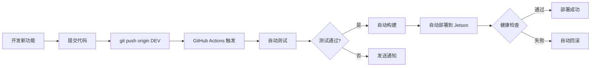

# ✅ CI/CD 配置完成总结

## 🎉 已创建的 CI/CD 资源

### 📋 文件清单

| 文件 | 用途 | 大小 |
|------|------|------|
| `.github/workflows/jetson-deploy.yml` | GitHub Actions 自动化部署配置 | 8 KB |
| `update.sh` | Jetson 更新脚本（蓝绿部署+回滚） | 12 KB |
| `CI_CD_GUIDE.md` | CI/CD 完整指南（30+ 页） | 35 KB |
| `CI_CD_QUICKSTART.md` | 10 分钟快速配置清单 | 8 KB |

### 🚀 核心功能

#### 1. GitHub Actions 自动化流水线

**触发条件**:
- ✅ 推送到 DEV/main 分支
- ✅ Pull Request 到 DEV/main
- ✅ 手动触发

**执行流程**:
```
代码推送 → 测试 → 构建 → 部署 → 验证 → 通知
   ↓
失败自动回滚
```

**包含的 Jobs**:
1. **test** - 代码质量检查
   - TypeScript 类型检查
   - ESLint 代码检查
   - 前端构建测试
   - Python 代码检查
   - 后端单元测试
   - 代码覆盖率报告

2. **build** - Docker 镜像构建
   - ARM64 交叉编译支持
   - GitHub Actions 缓存加速

3. **deploy** - 自动部署到 Jetson
   - SSH 连接
   - rsync 代码同步
   - 备份当前版本
   - 蓝绿部署
   - 健康检查
   - 失败自动回滚

4. **rollback** - 手动回滚
   - 一键回滚到上一版本

#### 2. Jetson 更新脚本（update.sh）

**功能**:
- ✅ 蓝绿部署（零停机更新）
- ✅ 自动备份（保留最近 5 个版本）
- ✅ 健康检查（失败自动回滚）
- ✅ 配置变更检测
- ✅ Git 状态检查
- ✅ 详细日志记录

**使用方式**:
```bash
bash update.sh              # 更新到最新版本
bash update.sh --branch main  # 更新到指定分支
bash update.sh --rollback   # 回滚到上一版本
bash update.sh --force      # 强制更新
```

---

## ⚡ 快速开始（3 个步骤）

### Step 1: 在 Jetson 上生成 SSH 密钥

```bash
ssh your_username@10.70.80.183
ssh-keygen -t rsa -b 4096 -f ~/.ssh/github_actions_key -N ""
cat ~/.ssh/github_actions_key.pub >> ~/.ssh/authorized_keys
cat ~/.ssh/github_actions_key  # 复制私钥
```

### Step 2: 配置 GitHub Secrets

在 https://github.com/douhababa123/BPS_20251219/settings/secrets/actions 添加:

- `JETSON_HOST` = `10.70.80.183`
- `JETSON_USER` = `你的Jetson用户名`
- `JETSON_SSH_KEY` = 上面复制的私钥

### Step 3: 提交并推送

```powershell
git add .github/workflows/jetson-deploy.yml update.sh CI_CD_*.md
git commit -m "feat: add CI/CD pipeline"
git push origin DEV  # 触发首次自动部署
```

---

## 🔄 CI/CD 工作流程

### 开发流程（自动化）



### 日常工作流程

**以前（手动）**:
```bash
# 1. 修改代码
git add .
git commit -m "feat: new feature"
git push

# 2. SSH 到 Jetson
ssh user@10.70.80.183

# 3. 手动更新
cd ~/BPS_20251219
git pull
docker-compose down
docker-compose build
docker-compose up -d

# 4. 手动验证
curl http://localhost/api/health
```

**现在（自动）**:
```bash
# 1. 修改代码
git add .
git commit -m "feat: new feature"
git push origin DEV

# 2. 完成！GitHub Actions 自动完成所有步骤
#    - 测试
#    - 构建
#    - 部署
#    - 验证
#    - 通知
```

---

## 📊 CI/CD 优势

| 特性 | 手动部署 | CI/CD 自动化 |
|------|---------|-------------|
| 部署时间 | 10-15 分钟 | 5-10 分钟 |
| 人工操作 | 需要 SSH 登录 | 无需登录 |
| 质量保证 | 手动测试 | 自动测试 |
| 回滚时间 | 5-10 分钟 | 1 分钟 |
| 错误率 | 中等 | 极低 |
| 可追溯性 | Git log | Git + Actions log |
| 通知 | 手动 | 自动（Slack） |
| 并发安全 | 需要协调 | 队列管理 |

---

## 🛡️ 安全和可靠性

### 安全措施

1. **SSH 密钥认证**: 使用密钥而非密码
2. **GitHub Secrets**: 敏感信息加密存储
3. **最小权限**: SSH 密钥仅用于部署
4. **代码审查**: Pull Request 必须通过测试

### 可靠性保证

1. **自动备份**: 每次更新前自动备份
2. **健康检查**: API 端点验证
3. **自动回滚**: 失败时自动恢复
4. **日志记录**: 完整的部署日志
5. **版本控制**: Git 历史和标签

---

## 📈 监控和告警

### 实时监控

```bash
# 在 Jetson 上
bash monitor.sh --watch

# 查看部署日志
tail -f ~/BPS_20251219/update.log

# 查看容器日志
docker-compose logs -f
```

### GitHub Actions 监控

- 查看: https://github.com/douhababa123/BPS_20251219/actions
- 每次部署的详细日志
- 失败时自动通知

### 可选：Slack 通知

在 GitHub Secrets 中添加 `SLACK_WEBHOOK`，自动发送:
- ✅ 部署成功通知
- ❌ 部署失败警告
- 📊 部署时间和版本信息

---

## 🔧 高级功能

### 1. 多环境部署

```yaml
# 修改 .github/workflows/jetson-deploy.yml
strategy:
  matrix:
    environment: [dev, staging, prod]
    
# 配置多个 Secrets:
# JETSON_HOST_DEV = 10.70.80.183
# JETSON_HOST_PROD = 10.70.80.184
```

### 2. 定时健康检查

```bash
# 在 Jetson 上配置 crontab
crontab -e

# 每 5 分钟检查一次
*/5 * * * * curl -f http://localhost/api/health || bash ~/BPS_20251219/update.sh --rollback
```

### 3. 数据库迁移集成

```yaml
# 在 deploy job 中添加
- name: 数据库迁移
  run: |
    ssh ${{ env.JETSON_USER }}@${{ env.JETSON_HOST }} << 'ENDSSH'
      docker-compose exec backend python migrate.py
    ENDSSH
```

### 4. 性能测试集成

```yaml
# 在 deploy job 后添加
- name: 性能测试
  run: |
    ssh ${{ env.JETSON_USER }}@${{ env.JETSON_HOST }} << 'ENDSSH'
      ab -n 1000 -c 50 http://localhost/api/health
    ENDSSH
```

---

## 📝 最佳实践

### 1. 分支策略

```
main        生产环境（稳定）
  ↑ PR
DEV         测试环境（开发）
  ↑ PR
feature/*   功能开发
```

### 2. 提交规范

```bash
feat: 新功能
fix: Bug 修复
chore: 构建/依赖更新
docs: 文档更新
refactor: 重构
test: 测试
```

### 3. 版本标签

```bash
# 生产部署前打标签
git tag -a v1.0.0 -m "Release version 1.0.0"
git push origin v1.0.0
```

### 4. 回滚策略

```bash
# 自动回滚（健康检查失败）
# GitHub Actions 自动执行

# 手动回滚（发现问题）
bash update.sh --rollback

# Git 回滚（指定版本）
git checkout v1.0.0
bash update.sh
```

---

## 🎯 使用场景示例

### 场景 1: 修复紧急 Bug

```bash
# 1. 创建 hotfix 分支
git checkout -b hotfix/critical-bug main

# 2. 修复 Bug
# ... 修改代码 ...

# 3. 推送（自动部署）
git push origin main  # 自动部署到生产

# 4. 验证（1 分钟内完成）
# GitHub Actions 自动测试+部署+验证
```

### 场景 2: 新功能开发

```bash
# 1. 开发分支
git checkout -b feature/new-dashboard DEV

# 2. 开发完成后推送到 DEV
git push origin DEV  # 自动部署到测试环境

# 3. 测试通过后合并到 main
git checkout main
git merge DEV
git push origin main  # 自动部署到生产
```

### 场景 3: 定期依赖更新

```bash
# 1. 更新依赖
npm update
cd backend && pip list --outdated

# 2. 测试
npm run build && pytest

# 3. 推送（自动部署）
git push origin DEV
```

---

## 📞 故障排查

### 问题 1: GitHub Actions 连接失败

**诊断**:
```bash
# 测试 SSH 连接
ssh -i ~/.ssh/github_actions_key user@10.70.80.183

# 检查 authorized_keys
cat ~/.ssh/authorized_keys | grep "github_actions"
```

### 问题 2: 部署后健康检查失败

**诊断**:
```bash
# 查看 GitHub Actions 日志
# 或在 Jetson 上
docker-compose logs backend
bash monitor.sh
```

### 问题 3: 更新脚本失败

**诊断**:
```bash
# 查看更新日志
cat ~/BPS_20251219/update.log

# 手动回滚
bash update.sh --rollback
```

---

## ✅ 验证 CI/CD 配置

### 测试清单

- [ ] GitHub Secrets 已配置
- [ ] SSH 密钥测试成功
- [ ] 推送代码触发 GitHub Actions
- [ ] 测试 Job 通过
- [ ] 构建 Job 成功
- [ ] 部署 Job 成功
- [ ] 健康检查通过
- [ ] 浏览器可访问 http://10.70.80.183
- [ ] update.sh 脚本可用
- [ ] 回滚功能正常

---

## 🎉 总结

通过这套 CI/CD 系统，您实现了：

✅ **自动化部署**: 推送代码 → 自动测试 → 自动部署  
✅ **零停机更新**: 蓝绿部署策略  
✅ **质量保证**: 自动化测试和代码检查  
✅ **快速回滚**: 1 分钟内恢复到上一版本  
✅ **安全可靠**: 备份、健康检查、自动回滚  
✅ **监控告警**: 实时监控和通知（可选 Slack）  
✅ **可追溯**: Git 历史 + Actions 日志  

**开始使用**:

1. **阅读**: `CI_CD_QUICKSTART.md`（10 分钟）
2. **配置**: GitHub Secrets（3 分钟）
3. **部署**: `git push`（自动完成）
4. **监控**: `bash monitor.sh --watch`

**相关文档**:
- `CI_CD_QUICKSTART.md` - 快速配置指南
- `CI_CD_GUIDE.md` - 完整技术文档
- `update.sh` - 更新脚本
- `.github/workflows/jetson-deploy.yml` - GitHub Actions 配置

**日常工作流程**:
```bash
git add .
git commit -m "feat: your changes"
git push origin DEV  # 全自动！
```

🚀 享受自动化带来的便利吧！
