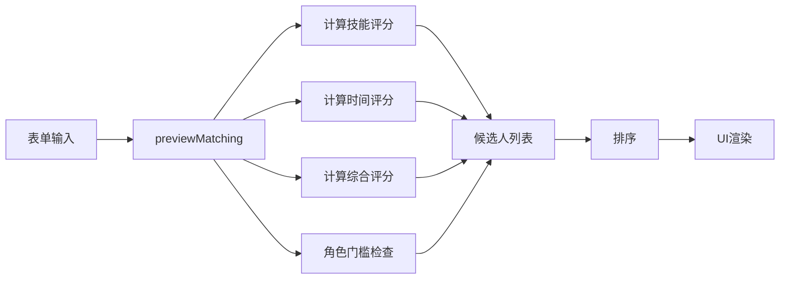

# 🎯 任务分配（Task Matching）模块逻辑梳理

## 📋 模块概述

任务分配模块是一个基于能力评估和时间可用性的**智能匹配系统**，用于将工程师任务分配给最合适的候选人。

### 核心文件
- **前端页面**: [src/pages/Matching.tsx](src/pages/Matching.tsx)
- **API服务**: [src/lib/mockApi.ts](src/lib/mockApi.ts)
- **类型定义**: [src/lib/types.ts](src/lib/types.ts)
- **常量配置**: [src/lib/constants.ts](src/lib/constants.ts)

---

## 🔄 业务流程

### 1️⃣ 工作流程（4步）

```
任务申请 → 智能匹配 → 任务审批 → 日程同步
  │          │          │          │
  ▼          ▼          ▼          ▼
需求方    系统打分   Site PS    自动写入
提交需求  推荐人选    审批      日历
```

**状态流转**:
- ✅ **已完成** (done): 绿色，已完成的步骤
- 🔄 **进行中** (processing): 蓝色，正在处理
- ⏸️ **待启动** (pending): 灰色，等待处理

---

## 📝 输入参数

### 任务基本信息
| 字段 | 类型 | 必填 | 说明 |
|------|------|------|------|
| `name` | string | ✅ | 任务名称 |
| `role` | 'Lead' \| 'Expert' \| 'Member' \| 'Coach' | ✅ | 角色要求 |
| `moduleId` | number | ✅ | 能力模块ID |
| `type` | TaskType | ✅ | 任务类型 (WS/SW/P/T/C/M/L/SD) |
| `location` | Location | ✅ | 地点 |
| `topic` | Topic | ✅ | 主题 |
| `startDate` | string | ✅ | 开始日期 |
| `endDate` | string | ✅ | 结束日期 |
| `suggestedUserId` | number | ❌ | 建议人选（可选） |

### 能力要求列表
每个能力要求包含：
| 字段 | 类型 | 说明 |
|------|------|------|
| `itemId` | number | 能力项ID |
| `requiredLevel` | 1-5 | 要求等级 |
| `isKey` | boolean | 是否关键项（影响权重） |

---

## 🧮 核心算法

### 1. 能力匹配评分（Skill Score）

#### 公式
```
对于每个能力项 i:
  base_i = min(Ci / Ri, 1)      // 当前能力 / 要求能力，上限1
  bonus_i = Ti > Ci ? 0.1 : 0   // 目标高于当前，额外奖励
  w_i = isKey ? 2 : 1           // 关键项权重翻倍
  si = (base_i + bonus_i) × w_i

技能评分 = Σ(si) / Σ(w_i)
```

#### 参数说明
- **Ci** (Current Level): 候选人当前能力等级
- **Ri** (Required Level): 任务要求能力等级
- **Ti** (Target Level): 候选人目标能力等级
- **w** (Weight): 权重（关键项=2，普通项=1）

#### 示例
```typescript
// 能力项1（关键项）: Ci=4, Ri=3, Ti=5
base = min(4/3, 1) = 1
bonus = 5 > 4 ? 0.1 : 0 = 0.1
w = 2 (关键项)
s1 = (1 + 0.1) × 2 = 2.2

// 能力项2（普通项）: Ci=2, Ri=3, Ti=4
base = min(2/3, 1) = 0.67
bonus = 4 > 2 ? 0.1 : 0 = 0.1
w = 1 (普通项)
s2 = (0.67 + 0.1) × 1 = 0.77

技能评分 = (2.2 + 0.77) / (2 + 1) = 0.99
```

---

### 2. 时间可用性评分（Time Score）

#### 公式
```
totalSlots = 计算工作日时段数（AM+PM）
usedSlots = 候选人已占用时段数
freeSlots = totalSlots - usedSlots

时间评分 = max(min(freeSlots / totalSlots, 1), 0)
```

#### 工作日时段计算
```typescript
function countWorkSlots(start: Date, end: Date): number {
  let count = 0;
  const current = new Date(start);
  while (current <= end) {
    const day = current.getDay();
    if (day !== 0 && day !== 6) {  // 排除周末
      count += 2;  // 每个工作日 = AM + PM = 2个时段
    }
    current.setDate(current.getDate() + 1);
  }
  return count;
}
```

#### 示例
```
任务周期: 2025-01-20 至 2025-01-24（5个工作日）
totalSlots = 5 × 2 = 10
候选人A已占用: 4个时段
freeSlots = 10 - 4 = 6

时间评分 = 6 / 10 = 0.6 (60%)
```

---

### 3. 综合评分（Final Score）

#### 公式
```
综合评分 = 0.5 × 技能评分 + 0.5 × 时间评分
```

#### 合格标准
```
合格人选: 综合评分 ≥ 1.0 (100%)
```

#### 示例
```
候选人A:
  技能评分 = 0.99
  时间评分 = 0.60
  综合评分 = 0.5 × 0.99 + 0.5 × 0.60 = 0.795 (79.5%)
  结果: 不合格

候选人B:
  技能评分 = 1.05
  时间评分 = 0.95
  综合评分 = 0.5 × 1.05 + 0.5 × 0.95 = 1.00 (100%)
  结果: 合格 ✅
```

---

### 4. 角色门槛检查（Role Gate）

仅对 **Lead** 和 **Expert** 角色进行检查。

#### 检查逻辑
```typescript
if (role !== 'Lead' && role !== 'Expert') return 'OK';

// 1. 计算关键项平均分
keyItemMean = Σ(关键项Ci) / 关键项数量

// 2. 计算模块平均分
moduleMean = Σ(所有模块项Ci) / 模块项数量

// 3. 判断是否满足阈值
if (keyItemMean >= threshold.keyItem && moduleMean >= threshold.moduleMean) {
  return 'OK';
}

return role === 'Lead' ? 'LEAD_LOW' : 'EXPERT_LOW';
```

#### 角色阈值
```typescript
const ROLE_THRESHOLDS = {
  Lead: {
    keyItem: 4.0,    // 关键项平均 ≥ 4.0
    moduleMean: 3.5  // 模块平均 ≥ 3.5
  },
  Expert: {
    keyItem: 3.5,    // 关键项平均 ≥ 3.5
    moduleMean: 3.0  // 模块平均 ≥ 3.0
  }
};
```

#### 返回状态
- ✅ **OK**: 满足角色要求
- ⚠️ **LEAD_LOW**: Lead角色能力不足
- ⚠️ **EXPERT_LOW**: Expert角色能力不足

---

## 🎨 UI展示逻辑

### 1. 候选人排序规则

```typescript
candidates.sort((a, b) => {
  // 1. 建议人选优先
  if (a.badges.includes('suggested') && !b.badges.includes('suggested')) return -1;
  if (!a.badges.includes('suggested') && b.badges.includes('suggested')) return 1;
  
  // 2. 合格人选优先
  if (a.qualified && !b.qualified) return -1;
  if (!a.qualified && b.qualified) return 1;
  
  // 3. 按综合评分降序
  return b.finalScore - a.finalScore;
});
```

### 2. 标签系统

| 标签 | 条件 | 样式 |
|------|------|------|
| 🏷️ **建议人选** | `suggestedUserId === userId` | 橙色 |
| ✅ **合适人选** | `finalScore >= 1.0` | 绿色 |
| 📌 **推荐** | 无合格人选时的Top3 | 橙色 |

### 3. 卡片样式

```tsx
// Top1候选人：蓝色渐变背景
isTop ? 'bg-gradient-to-r from-blue-50 to-blue-100 border-blue-300'

// 其他候选人：白色背景
: 'bg-white border-gray-200 hover:border-blue-300'
```

### 4. 角色门槛颜色

| 状态 | 颜色 | 含义 |
|------|------|------|
| OK | 🟢 绿色 | 符合角色要求 |
| LEAD_LOW | 🟡 橙色 | Lead能力需提升 |
| EXPERT_LOW | 🔴 红色 | Expert能力需提升 |

---

## 📊 匹配洞察面板

### 统计数据
```typescript
const matchingSummary = {
  avgSkill: 平均技能匹配度（所有候选人）,
  avgTime: 平均时间匹配度（所有候选人）,
  topScore: Top1候选人综合评分
};
```

### 智能提示
```typescript
// 有合格人选
if (qualifiedCandidates.length > 0) {
  显示: "系统已识别 X 位得分 ≥100% 的合适人选"
  展示: 前4位合格人选名单
}

// 无合格人选
else {
  显示: "暂未找到得分 ≥100% 的人选，以下候选作为 Top3 推荐供 Site PS 参考"
  展示: Top3候选人名单
}
```

---

## 🔍 详情抽屉

点击"查看详情"按钮时，右侧弹出详情抽屉，显示：

### 1. 能力评分详情
```
每个能力项显示：
- 能力项名称
- 关键项标记
- 单项得分 (si)
- Ci, Ri, Ti, w 参数
- base, bonus 计算值

汇总：
- Total Weight (总权重)
- Final Skill Score (最终技能得分)
```

### 2. 时间可用性
```
- 已占用时间段 (workSlots)
- 空闲时间段 (freeSlots)
- 可视化进度条
- Time Score (时间评分)
```

### 3. 角色门槛检查
```
- 检查结果状态（OK / LEAD_LOW / EXPERT_LOW）
- 角色要求说明
- 阈值标准展示
```

---

## 🎯 数据流转

### 输入 → 处理 → 输出



### API调用流程

```typescript
// 1. 预览匹配
previewMutation.mutate(request)
  ↓
mockApi.previewMatching(request)
  ↓
返回: MatchingCandidate[]

// 2. 确认指派
assignMutation.mutate()
  ↓
mockApi.assignTask()
  ↓
返回: { success: true }
```

---

## 📦 数据结构

### MatchingRequest（匹配请求）
```typescript
interface MatchingRequest {
  name: string;                    // 任务名称
  role: 'Lead' | 'Expert' | ...;   // 角色
  moduleId: number;                 // 能力模块ID
  type: TaskType;                   // 任务类型
  location: Location;               // 地点
  topic: Topic;                     // 主题
  startDate: string;                // 开始日期
  endDate: string;                  // 结束日期
  required: Array<{                 // 能力要求
    itemId: number;
    requiredLevel: number;
    isKey: boolean;
  }>;
  suggestedUserId?: number;         // 建议人选（可选）
}
```

### MatchingCandidate（候选人）
```typescript
interface MatchingCandidate {
  userId: number;           // 用户ID
  name: string;             // 姓名
  dept: string;             // 部门
  homeLocation: string;     // 所在地
  skillScore: number;       // 技能评分 (0-1+)
  timeScore: number;        // 时间评分 (0-1)
  finalScore: number;       // 综合评分 (0-1+)
  qualified: boolean;       // 是否合格 (finalScore >= 1.0)
  roleGate: 'OK' | 'LEAD_LOW' | 'EXPERT_LOW';  // 角色门槛
  badges: string[];         // 标签数组
  explain: {                // 详细说明
    items: Array<{
      itemId: number;
      Ci: number;          // 当前能力
      Ri: number;          // 要求能力
      Ti: number;          // 目标能力
      isKey: boolean;      // 是否关键项
      base: number;        // 基础分
      bonus: number;       // 奖励分
      w: number;           // 权重
      si: number;          // 单项得分
    }>;
    sumW: number;          // 总权重
    skillScore: number;    // 技能评分
    time: {
      workSlots: number;   // 已占用时段
      freeSlots: number;   // 空闲时段
      timeScore: number;   // 时间评分
    };
  };
}
```

---

## 🚀 优化建议

### 当前问题

#### 1. **数据来源问题**
```
❌ 当前使用: mockData（静态假数据）
✅ 应该使用: Supabase真实数据
```

**影响**:
- 匹配结果不准确
- 无法反映实际能力评估
- 无法查询真实日历占用

#### 2. **算法可调整性**
```
❌ 当前权重: 固定 0.5 × 技能 + 0.5 × 时间
✅ 建议: 可配置权重
```

**建议参数**:
```typescript
interface MatchingConfig {
  skillWeight: number;      // 技能权重 (0-1)
  timeWeight: number;       // 时间权重 (0-1)
  keyItemWeight: number;    // 关键项权重倍数 (默认2)
  bonusScore: number;       // 目标高于当前的奖励分 (默认0.1)
}
```

#### 3. **缺少历史数据**
```
❌ 无法追踪: 历史匹配记录
✅ 应该记录:
   - 哪些任务使用了匹配系统
   - 推荐的候选人
   - 最终选择的候选人
   - 任务完成质量评价
```

#### 4. **审批流程未实现**
```
❌ 当前: 点击"立即指派"直接成功
✅ 应该: 
   1. 提交审批申请
   2. Site PS审核
   3. 审批通过后写入日程
   4. 发送通知
```

---

## 🔧 待实现功能

### 第一优先级（1周内）

#### 1. 对接真实数据
- [ ] 从Supabase读取员工能力评估数据
- [ ] 从Supabase读取任务日历数据
- [ ] 替换mockApi为supabaseService

#### 2. 保存匹配记录
- [ ] 创建数据库表 `task_matching_records`
- [ ] 记录每次匹配的输入参数
- [ ] 记录匹配结果和最终选择

### 第二优先级（2周内）

#### 3. 审批流程
- [ ] 创建审批表 `task_approvals`
- [ ] 实现审批状态机
- [ ] 审批通知（邮件/站内信）

#### 4. 权重配置
- [ ] 添加管理员配置页面
- [ ] 支持调整权重参数
- [ ] 保存配置到数据库

### 第三优先级（1个月内）

#### 5. 高级功能
- [ ] 批量任务匹配
- [ ] 团队匹配（多人协作任务）
- [ ] 匹配结果分析报表
- [ ] 历史匹配准确率统计

---

## 📈 性能指标

### 关键指标
- **匹配速度**: 当前约500ms（mockData），真实数据需优化
- **候选人数量**: 理论支持全员匹配（当前测试20人）
- **能力项数量**: 支持任意数量能力项（已测试10+项）

### 性能优化建议
```typescript
// 1. 数据预加载
useEffect(() => {
  queryClient.prefetchQuery(['modules']);
  queryClient.prefetchQuery(['items']);
}, []);

// 2. 计算缓存
const cachedResult = useMemo(() => 
  expensiveCalculation(data), 
  [data]
);

// 3. 分页加载候选人（超过50人时）
```

---

## 🎓 使用示例

### 场景1: TPM Lead任务分配

```typescript
// 输入
{
  name: "FDCCh TPM Audit",
  role: "Lead",
  moduleId: 4,  // Waste-free&stable flow_TPM
  type: "P",
  location: "FDCCh",
  topic: "TPM",
  startDate: "2025-02-01",
  endDate: "2025-02-07",
  required: [
    { itemId: 10, requiredLevel: 4, isKey: true },   // TPM系统导入（关键）
    { itemId: 11, requiredLevel: 3, isKey: false },  // 设备管理
    { itemId: 12, requiredLevel: 3, isKey: false },  // 预防性维护
  ]
}

// 输出（示例）
候选人A:
  技能评分: 1.05 (105%)
  时间评分: 0.80 (80%)
  综合评分: 0.93 (93%)
  角色门槛: OK ✅
  结果: 不合格（未达100%）

候选人B:
  技能评分: 1.15 (115%)
  时间评分: 0.95 (95%)
  综合评分: 1.05 (105%)
  角色门槛: OK ✅
  结果: 合格 ✅✅
```

### 场景2: 无合格人选时的降级推荐

```typescript
// 输入: 要求极高的Expert任务
{
  role: "Expert",
  required: [
    { itemId: 15, requiredLevel: 5, isKey: true },
    { itemId: 16, requiredLevel: 5, isKey: true },
    { itemId: 17, requiredLevel: 4, isKey: false },
  ]
}

// 输出
无合格人选（所有候选人 < 100%）

系统推荐 Top3:
1. 候选人C - 92% (最接近)
2. 候选人D - 87%
3. 候选人E - 83%

提示: "暂未找到得分 ≥100% 的人选，以下候选作为 Top3 推荐供 Site PS 参考"
```

---

## 📚 相关文档

- [能力画像模块实现](COMPETENCY_IMPLEMENTATION_SUMMARY.md)
- [日程管理模块总结](FINAL_SCHEDULE_SUMMARY.md)
- [数据库结构设计](SCHEDULE_DATABASE_SCHEMA.sql)
- [前端集成方案](FRONTEND_INTEGRATION_PLAN.md)

---

## 🤝 团队协作

### 角色分工
- **需求方**: 填写任务信息和能力要求
- **系统**: 自动计算匹配度并推荐
- **Site PS**: 审批并最终确认人选
- **被分配工程师**: 自动接收日程更新

### 权限设计建议
```typescript
enum Permission {
  CREATE_TASK = 'matching:create',      // 创建匹配任务
  PREVIEW_MATCH = 'matching:preview',   // 预览匹配结果
  ASSIGN_TASK = 'matching:assign',      // 直接指派（需要审批权限）
  APPROVE_TASK = 'matching:approve',    // 审批任务（Site PS）
}
```

---

**文档版本**: v1.0  
**更新日期**: 2025-01-30  
**维护人**: GitHub Copilot  
**状态**: 🟢 当前逻辑梳理完成，待优化实施
